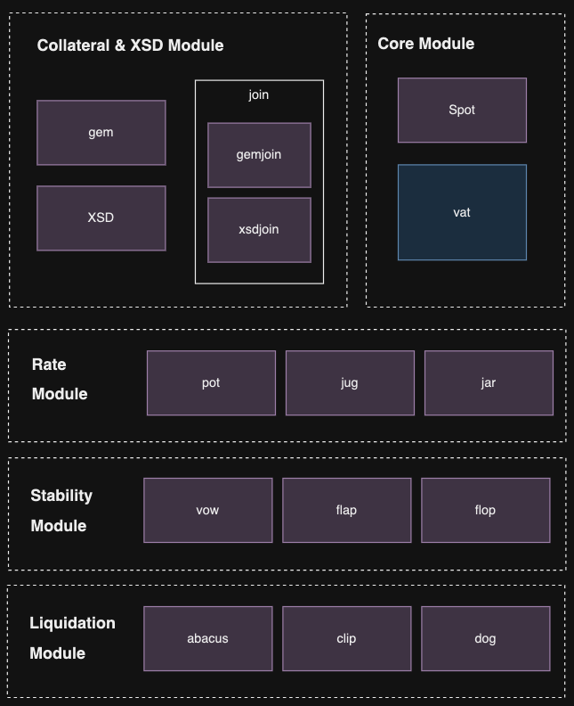

# xrBankDAO: The Liquidity Layer for XRP EVM-Sidechain

XrBankDAO was created to provide stablecoin liquidity to the emerging XRPL EVM sidechain, fostering growth within the ecosystem. Additionally, it was developed to enable XRP holders who supply liquidity to utilize their assets more efficiently and, if needed, to use stablecoins with low volatility.

## Why xrBankDAO?

XRPL’s DeFi ecosystem holds tremendous potential. In the Korean market alone, over 8 billion XRP are held on centralized exchanges (CEX, upbit/bithumb), with more than 2 million holders. However, the DeFi market remains relatively undeveloped.

Moving forward, XRPL plans to launch its own fiat-backed stablecoin and an EVM sidechain. However, relying solely on bridged fiat-backed stablecoins introduces risks such as volatility of backing assets, bridge vulnerabilities, and supply shortages.

We are committed to filling this crucial gap by introducing a robust, crypto-backed stablecoin that will serve as the foundation for XRPL’s DeFi ecosystem. This stablecoin will not only enhance the security and stability of the network but also provide XRP holders with new opportunities to earn yield and participate in decentralized finance. Our vision is to unlock the full potential of XRPL’s DeFi capabilities, ensuring that it becomes a leading player in the global blockchain economy.

---

## System Design Diagrams and Narrative

### System Design Overview

xrBankDAO’s architecture follows a decentralized model to maintain security and reliability. The core contracts handle collateral, stablecoin issuance, yield generation, and liquidation if necessary. The primary components include:

- **Vault**: Manages collateral deposits, mints stablecoins, and ensures solvency.
- **Minting**: Allows users to mint stablecoins (XSD) against their deposited XRP collateral.
- **Earnings**: Users can earn yield by providing liquidity or through interest-bearing features on XSD.

# MakerDAO Smart Contract Components

The MakerDAO protocol comprises multiple contracts, each with a distinct role in managing and executing the stablecoin system. Here’s an overview of the main components:

| **Contract** | **Functionality**                                                                           |
| ------------ | ------------------------------------------------------------------------------------------- |
| **abaci**    | Manages the price decrease function for auctions, determining the pace of price reductions. |
| **clip**     | Handles Liquidation 2.0 mechanics, ensuring an efficient liquidation process.               |
| **dog**      | Initiates auctions, triggering the liquidation mechanism when necessary.                    |
| **join**     | ERC20 token adapters that enable the protocol to interface with external tokens.            |
| **jug**      | Collects stability fees, a crucial part of maintaining the stablecoin’s peg.                |
| **spot**     | Fetches oracle price data, providing accurate asset valuations for the protocol.            |
| **xsd**      | The stablecoin itself, designed to maintain stability within the ecosystem.                 |
| **vat**      | The core CDP (Collateralized Debt Position) vault, where collateral and debt are managed.   |
| **vow**      | Acts as the vault balance sheet, tracking surplus and debt to ensure system stability.      |

Each contract interlocks to create a robust, decentralized system for issuing and maintaining stablecoins, underscoring MakerDAO's position as a leading DeFi protocol.

## XrBankDAO Smart Contract

XrBankDAO is a **MakerDAO Forked Project** on the XRPL EVM-sidechain. Below are the contract addresses deployed on the XRPL EVM-sidechain testnet:

| Contract                 | Address                                      |
| ------------------------ | -------------------------------------------- |
| **Vat Contract**         | `0x61f75708517e74B2d5eA3D26159338C564c23a1C` |
| **Gem Contract**         | `0x8049c9E3cE496b47E0fE8aa8EdAEf751cF87e07d` |
| **GemJoin Contract**     | `0x175Ad21516707BE6c5fe47C89C6590C434e6232f` |
| **XSD Contract**         | `0x9b1A76B9749014A469354352bC70A12A0518C97d` |
| **XsdJoin Contract**     | `0x00d93c10118654bDA344b4A7A212e234a82631aA` |
| **CDP Manager Contract** | `0x68D6d12De9D35871E802E46B64Df9EFe7f2e888c` |
| **OneClick Contract**    | `0xCFCaC874D81e24988242F08F8D4287119Cc2c80f` |
| **Jug Contract**         | `0x1D13A32b62BaC1E4e37D7C7F0F93B3eB6291BdBC` |
| **Spot Contract**        | `0xf8704B3fB65925510f99dC8271c10f27BdE88228` |

Each contract plays a critical role in managing and executing the various functionalities within XrBankDAO's DeFi ecosystem on XRPL EVM.

## How to Interact with the Smart Contract Online

1. **Visit the Contract Explorer**  
   Go to the following website, replacing `{SmartContractAddress}` with the actual address of your smart contract:  
   [https://explorer.xrplevm.org/address/{SmartContractAddress}](https://explorer.xrplevm.org/address/{SmartContractAddress})

2. **Access the Contract**
   - Click on **"Contract"** to open the contract's details.
   - Choose **"Read Contract"** or **"Write Contract"** depending on the action you want to perform.

This will allow you to read data from or write transactions to the contract directly through the explorer.
